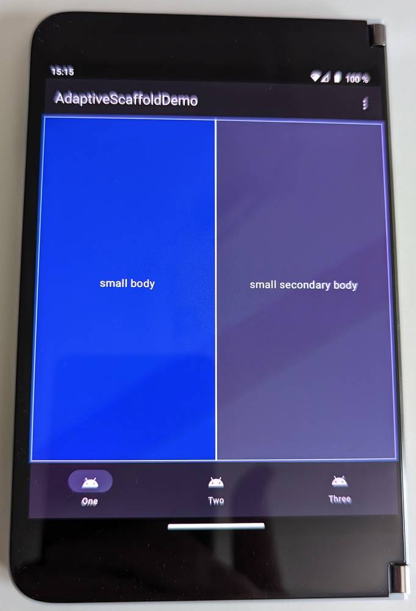
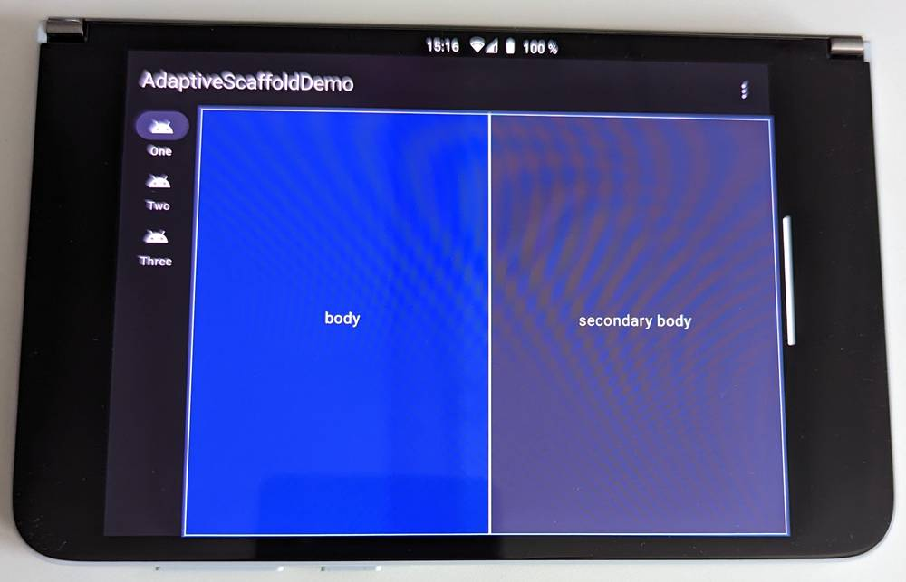
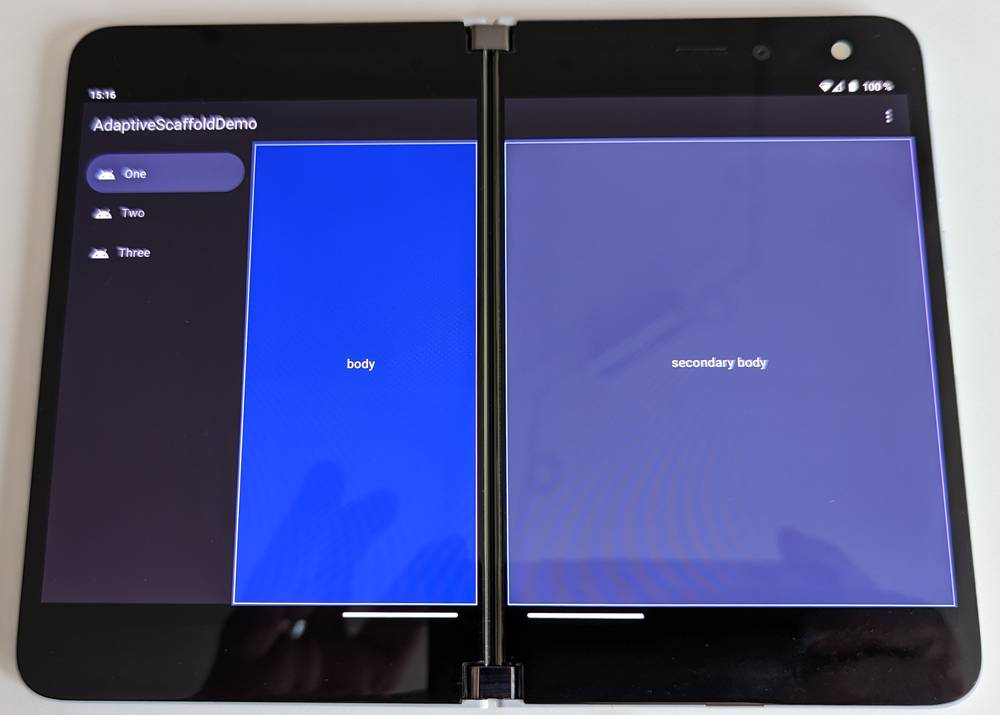
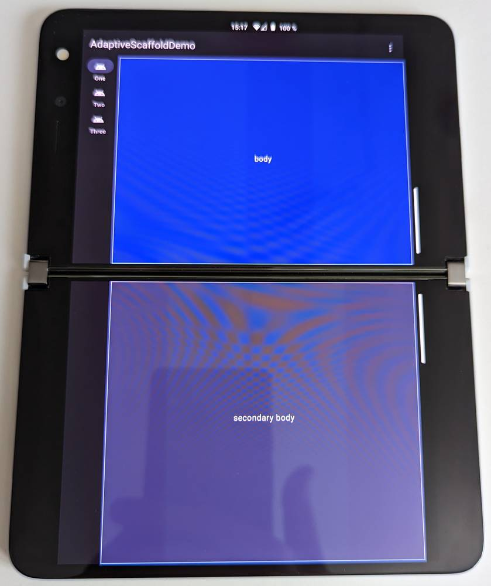

# Welcome to compose_adaptive_scaffold

The aim of this library is to make writing Jetpack Compose apps that
support large screen and foldable devices a breeze. Here's a short clip that showcases how the
library works. Clicking on the preview image directs you to YouTube.

[](https://youtu.be/nJDmJ0mmpys)

*compose_adaptive_scaffold* is based on the idea of two panes, called *body* and *secondary body*.
For small screens you pass alternatives (or variations) called *small body* and *small secondary
body* (the latter one is optional). Depending on your screen layout, the pairs *body* and *small
body*, and *secondary body* and *small secondary body* may even be the same. Two panes are the basis
for *Canonical Layouts*, an important Material Design concept.

Under the hood, *compose_adaptive_scaffold* uses *Jetpack WindowManager* to provide full hinge 
support. This means that you do not need to worry about screen dimensions, location and sizes of 
hinges, and hinge features like orientation. Just provide *body* and *secondary body* 
composables - everything else is handled by *compose_adaptive_scaffold*.

<p>




</p>

### Setup

The library is available through Maven Central. To include it in your apps, just add an
implementation dependency:

```groovy
dependencies {
    implementation "com.github.tkuenneth:compose_adaptive_scaffold:0.5.2"
}
```

It uses the following configuration:

| Property | Value                                |
| -------- |--------------------------------------|
| `namespace` | `eu.thomaskuenneth.adaptivescaffold` |
| `minSdk` | `30`                                 |
| `targetSdk` | `35`                                 |

Used libraries:

| Name | Version      |
| -------- |--------------|
| *Jetpack WindowManager* | `1.3.0`      |
| *Jetpack Compose BOM* | `2024.09.01` |

### How to use

Here's how a simple sample activity looks like:

```kotlin
class SimpleDemoActivity : ComponentActivity() {
  @OptIn(ExperimentalMaterial3Api::class)
  override fun onCreate(savedInstanceState: Bundle?) {
    super.onCreate(savedInstanceState)
    setContentRepeatOnLifecycleStarted {
      MaterialTheme(
        content = {
          AdaptiveScaffold(
            startDestination = destination1,
            otherDestinations = listOf(destination2),
            onDestinationChanged = {
              // do something
            },
            topBar = {
              TopAppBar(
                title = {
                  Text(
                    text = stringResource(
                      id = R.string.app_name
                    )
                  )
                })
            },
          )
        },
        colorScheme = defaultColorScheme()
      )
    }
  }
}
```

Have you noticed there is no `setContent {}` but instead `setContentRepeatOnLifecycleStarted {}` is used?
This is just a tiny wrapper. It is implemented like this:

```kotlin
fun ComponentActivity.setContentRepeatOnLifecycleStarted(
    enableEdgeToEdge: Boolean = false,
    parent: CompositionContext? = null,
    content: @Composable () -> Unit
) {
    if (enableEdgeToEdge) enableEdgeToEdge()
    lifecycleScope.launch {
        lifecycle.repeatOnLifecycle(Lifecycle.State.STARTED) {
            setContent(
                parent = parent,
                content = content
            )
        }
    }
}
```

This is needed to get informed upon posture and orientation changes. The two destinations that are passed
to `AdaptiveScaffold` are defined like this:

```kotlin
val destination1 = NavigationDestination(
    icon = R.drawable.ic_android_black_24dp,
    label = R.string.one,
    body = {
        Box(
            modifier = Modifier
                .fillMaxSize()
                .background(color = Color.Red)
        )
    },
    secondaryBody = {
        Box(
            modifier = Modifier
                .fillMaxSize()
                .background(color = Color.Green)
        )
    },
    smallBody = {
        Box(
            modifier = Modifier
                .fillMaxSize()
                .background(color = Color.Blue)
        )
    },
    smallSecondaryBody = {
        Box(
            modifier = Modifier
                .fillMaxSize()
                .background(color = Color.Yellow)
        )
    },
)

val destination2 = NavigationDestination(
    icon = R.drawable.ic_android_black_24dp,
    label = R.string.two,
    overlay = {
        Box(
            modifier = Modifier
                .fillMaxSize()
                .background(color = Color.LightGray)
        )
    },
)
```

`NavigationDestination` receives an icon, a label, and five composable functions:

1. a body
2. a secondary body
3. a small body
4. a small secondary body (can be `null`)
5. an overlay (optional)

Depending on the app window size, either *body* and *secondary body* **or** *small body*
and *small secondary body* are shown. If the device has a hinge, all features of the hinge including
its location, size, and orientation are honored.

If you want to show something that should span the two panes, you can pass a `overlay` composable 
to `NavigationDestination`. Please have a look at `destinationFoldInfo` in *AdaptiveScaffoldDemoActivity.kt*
to see how that works. In this example the two panes are empty, so the overlay becomes the main content.

Inside your composable functions, you can use `LocalFoldDef.current` to find out the 
current window size classes and the configuration of the fold or hinge.

```kotlin
@Composable
private fun FoldDefInfo() {
  with(LocalFoldDef.current) {
    LazyColumn(
      contentPadding = PaddingValues(horizontal = 16.dp, vertical = 8.dp),
    ) {
      item {
        FoldDefInfoItem("isSeparating", isSeparating.toString())
        FoldDefInfoItem("orientation", orientation.toString())
        FoldDefInfoItem("occlusionType", occlusionType.toString())
        VerticalSpacer()
        FoldDefInfoItem(
          "windowWidthSizeClass",
          windowSizeClass.windowWidthSizeClass.toString().lastPart()
        )
        FoldDefInfoItem(
          "windowHeightSizeClass",
          windowSizeClass.windowHeightSizeClass.toString().lastPart()
        )
        VerticalSpacer()
        FoldDefInfoItem("foldWidth", foldWidth.toString())
        FoldDefInfoItem("foldHeight", foldHeight.toString())
        VerticalSpacer()
        FoldDefInfoItem("widthLeftOrTop", widthLeftOrTop.toString())
        FoldDefInfoItem("heightLeftOrTop", heightLeftOrTop.toString())
        VerticalSpacer()
        FoldDefInfoItem("widthRightOrBottom", widthRightOrBottom.toString())
        FoldDefInfoItem("heightRightOrBottom", heightRightOrBottom.toString())
      }
    }
  }
}
```

### Acknowledgements

*compose_adaptive_scaffold* is inspired by the Flutter 
package [flutter_adaptive_scaffold](https://pub.dev/packages/flutter_adaptive_scaffold).
